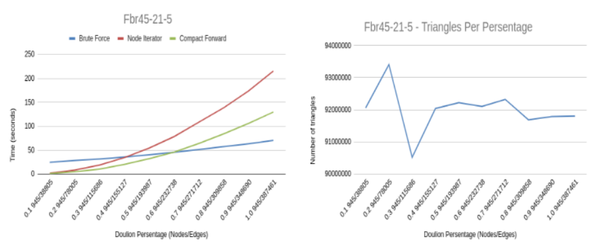
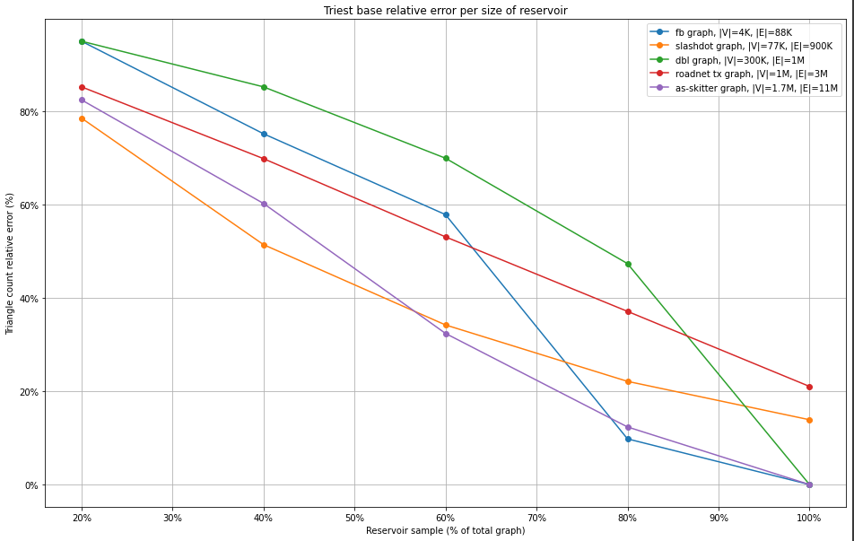

# Triangle Counting in Undirected Graphs

## Motivation

In the world of business and decision-making, understanding the underlying patterns and dynamics of networks is becoming increasingly crucial. That's where triangle counting comes into play! 

Triangles, simple closed loops of three interconnected nodes, unlock a wealth of insights that can empower business strategies. By harnessing triangle counting techniques, you can reveal hidden clusters and communities within your data, identify strong relationships and potential partnership opportunities, optimize recommendation systems to enhance customer engagement, and even gain a competitive edge by analyzing information diffusion and viral marketing potential. 

## Summary

This project is focused on exact and approximate triangle counting and listing algorithms. More specifically, we have implemented and compared the following exact algorithms:

1. Brute force.

2. Node Iterator.

3. Compact Forward.

Since, these algorithms can be pretty inefficient for large graphs, we have also implemented the [DOULION](https://dl.acm.org/doi/10.1145/1557019.1557111) algorithm which sparcifies a graph, and then we can use any of the previous algorithms to approximately count the input graph's triangles.

Finally we have implemented the [TRIEST-Base](https://dl.acm.org/doi/10.1145/3059194) algorithm (its version for edge insertions only), which is a graph counting algorithm for streaming graphs, i.e. an algorithm that reads the edges of the input graph incrementally, and counts its triangles on-the-go, as it reads the graph.

For our experiments, graphs of various sizes and with varying properties were used.

This project was completed within the scope of the 'Managing and Mining Complex Networks' course of the 'Data and Web Science' MSc programme of Aristotle University of Thessaloniki (AUTH) for the winter semester of 2022.

# Algorithm Descriptions

In the following, we consider an undirected graph $\mathcal{G} = G(V, E)$, where $|V| = n$ is the number of nodes in the graph, and $|E| = m$ the number of edges in the graph.

## Brute Force

A simple algorithm which checks eall triplets of nodes $u,v,w$. If all edges between each triplet apper in the graph, then a triangle has been detected.

* *Complexity:* $\mathcal{O}(n^3)$

* *Issue:* Extremely expensive for large graphs (i.e. large $n$).

## Node Iterator

In this algorithm, for every node of $\mathcal{G}$, we check if it forms any triangles with its neighbors. Let $v$ be a node to check. Take all possible pairs of nodes $u, w$ (both neighbours of $v$) and check if they are connected by an edge. If yes, then a triangle has been detected.

* *Complexity:* $\mathcal{O}(n \cdot d_{max}^{2})$, where $d_{max}$ is the maximum degree of a node in the input graph.

* *Issue:* Extremely expensive for graphs with very large maximal degree.

## Compact Forward

This algorithm is slightly more complex than they previous two, but in essence

* *Complexity:* $\mathcal{O}(m^{3/2})$

* *Issue:* Better than the previous two algorithms, but still very expensive for large graphs.

## DOULION

DOULION is a sparsification algorithm, i.e. an algorithm that reduces the number of edges ($m$) in the input graph. The reason for this is because triangle counting is highly related $m$. This is a very useful method for the cases when our input graph

The idea behind this algorithm is that for each edge in the graph we toss a coin and we keep the edge with probability $p$ or we delete it with probability $1-p$. As a result we get a graph with fewer edges $\mathcal{G}$'. Then we can apply any of the previous algorithms on $\mathcal{G}$'. Due to the sparcification, each triangle in $\mathcal{G}$' counts as $\frac{1}{p^{3}}$ triangles for the total graph $\mathcal{G}$. For more details on the DOULION algorithm, please check [this](https://dl.acm.org/doi/10.1145/1557019.1557111) paper.

* *Complexity:* $\mathcal{O}(m)$
* *Issue:* Depending on the parameter *p* we set, the sparcified graph can be quite different from the original one.

## TRIEST-Base

TRIEST-Base is an algorithm that gives an approximate triangle count for a stream of graph edges. It's main idea is that it creates and preserves a random sample (uniformly at random - through a technique called 'reservoir sampling') of the incoming edge stream, and counts the number of triangles within that random sample. For more details on the TRIEST-Base algorithm, please check [this](https://dl.acm.org/doi/10.1145/3059194) paper.

# Key Findings

## Brute Force magic

Although it is clear (and also easily verified by some simple experiments) that the brute-force algorithm is the worst out of our basic algorithms, we found a case where it actually outperformed them!

For this test case we used the [Fbr45-21-5](https://networkrepository.com/frb45-21-5.php) graph, which contains 945 nodes and 387.461 edges, and we ran our algorithms with DOULION for different values of the parameter $p$ (named 'Doulion Percentage' in the plots below).

As we can see, for a small percentage of the graph, Node Iterator and Compact Forward achieve
better time performance compared to Brute Force. As the number of edges we keep increases, so does the execution time for all our algorithms, but, when we go beyond keeping more than 40% of the graph, we see that both Node Iterator's and Compact Forward's execution times blow up, while Brute Force's remains low!

On the right graph, we can see the number of triangles found by DOULION + Brute Force, and we can see that it settles around the correct number of triangles approximately from keeping ~40% of the graph.

## TRIEST-Base performance

In the following plot, we can see the accuracy of TRIEST-Base for a number of different graphs. On the y axis we have calculated the relative percentage error for the number of triangles in each graph.

As we expected, for small samples we have large errors, and these errors decrease for all graphs as the sample size increses. One interesting note here is that for some graphs, even if we keep 100% of the graph, we still seem to get a relative error in the neighbourhood of 20%. Due to the nature of the algorithm, the order of the incoming edges from the stream, affects the number of triangles found. Therefore, to get an even more accurate result, we could have tried running a number of experiments for each graph, but shuffling the edges in the stream each time. We suspect this is the reason why we don't see 0 error when keeping the entire graph.